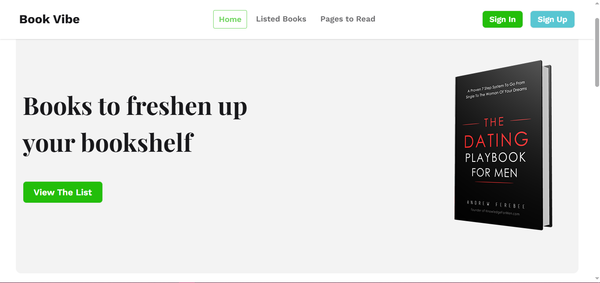

# 📚 Book Vibe — Your Personal Reading Companion



> **BookVibe** is a modern, responsive book management web application built with React. Discover books, track your reading progress, and curate your personal wishlist — all in one beautifully designed platform.

---


##  Live Demo

🔗 https://book-resources-app.vercel.app/

---


##  Features

-  **Browse Books** — Explore a curated collection of books
-  **Book Details** — View in-depth details for each book
-  **Read List** — Mark books as read and track your progress
-  **Wishlist** — Save books you want to read in the future
-  **Persistent Storage** — Read list & wishlist saved via LocalStorage
-  **Toast Notifications** — Instant feedback on every action
-  **Fully Responsive** — Optimized for all screen sizes

---

## 🛠️ Tech Stack

| Technology | Purpose |
|---|---|
|  **React 19** | UI Library |
|  **React Router v7** | Client-side routing |
|  **Tailwind CSS v4** | Utility-first styling |
|  **DaisyUI** | Component library |
|  **Context API** | Global state management |
|  **LocalStorage** | Data persistence |
|  **React Toastify** | Toast notifications |
|  **Playfair Display + Work Sans** | Typography |

---

## 📁 Project Structure

```
src/
├── components/
│   └── shared/
│       └── Navbar/
│           └── Navbar.jsx
├── contexts/
│   └── BookContext.jsx        
├── layouts/
│   └── MainLayout.jsx         
├── pages/
│   ├── homepages/
│   │   └── HomePage.jsx
│   ├── books/
│   │   └── Books.jsx
│   ├── bookDetails/
│   │   └── BookDetails.jsx
│   ├── readBooksPage/
│   │   └── ReadBooksPage.jsx
│   └── errorPage/
│       └── ErrorPage.jsx
├── routes/
│   └── Routes.jsx             
├── utils/
│   ├── LocalReadListDB.js     
│   └── LocalWishListDB.js     
├── index.css                 
└── main.jsx                 
public/
└── booksData.json             
```

---

##  Getting Started

### Prerequisites

Make sure you have the following installed:

- [Node.js](https://nodejs.org/) (v18 or above)
- [npm](https://www.npmjs.com/) or [yarn](https://yarnpkg.com/)

### Installation

1. **Clone the repository**

```bash
git clone https://github.com/IamPial/book-resources-app.git
cd book-resources-app
```

2. **Install dependencies**

```bash
npm install
```

3. **Start the development server**

```bash
npm run dev
```

4. **Open in browser**

```
http://localhost:5173
```

---

##  Build for Production

```bash
npm run build
```

The production-ready files will be in the `dist/` folder.

---

##  Routes Overview

| Path | Component | Description |
|---|---|---|
| `/` | `HomePage` | Landing page with hero section |
| `/books` | `Books` | Browse all books |
| `/bookDetails/:id` | `BookDetails` | Individual book detail view |
| `/readBooksPage` | `ReadBooksPage` | View read & wishlist books |
| `*` | `ErrorPage` | 404 not found page |

---

## 🗃️ State Management

The app uses **React Context API** via `BookContext` to manage:

- **`readList`** — List of books marked as read
- **`wishList`** — List of books saved to wishlist
- **`handleBookReadBtn(book)`** — Adds a book to the read list
- **`handleWishListBtn(book)`** — Adds a book to the wishlist (cannot add if already in read list)

Both lists are persisted to **LocalStorage** so data survives page refreshes.

---

## 🤝 Contributing

Contributions are welcome! Please follow these steps:

1. Fork the repository
2. Create a new branch: 
3. Commit your changes:
4. Push to the branch: 
5. Open a Pull Request

---

## 📄 License

This project is licensed under the [MIT License](./LICENSE).

---

##  Author

**Pial Uddin**
- GitHub: [IamPial](https://github.com/IamPial)
- LinkedIn: [Pial Uddin](https://linkedin.com/in/pial-uddin)


